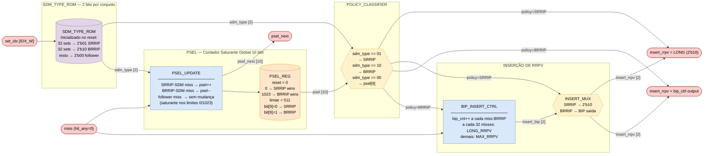
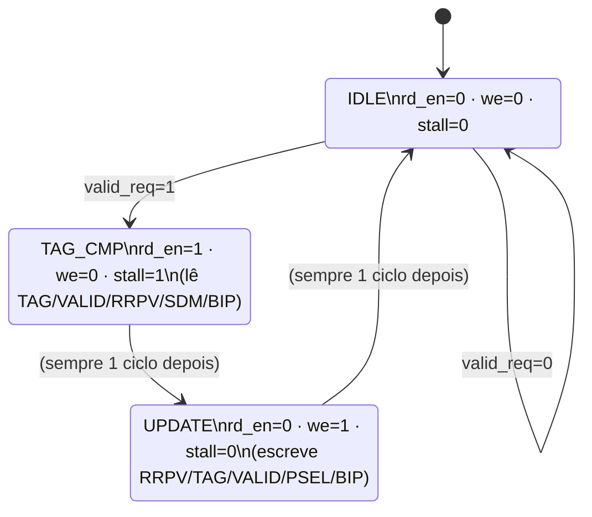

# DRRIP-Jaleel — Diagrama RTL Estrutural

Mapeamento do simulador C (`drrip_jaleel.c` / `cache.c`) para componentes físicos de
hardware implementáveis em Verilog / FPGA.
Referência: Jaleel *et al.*, ISCA 2010 — Seções 4.2, 4.3 e 4.4.

---

## 1. Mapeamento C → Hardware

| Elemento C | Componente RTL | Tipo de hardware |
|---|---|---|
| `cache_line_t.valid` | `valid_regfile[N_SETS][N_WAYS]` | Flip-flop (1 bit / linha) |
| `cache_line_t.tag` | `tag_sram[N_SETS][N_WAYS][TAG_W]` | SRAM dual-port |
| `cache_line_t.rrpv` | `rrpv_regfile[N_SETS][N_WAYS][2]` | Flip-flop (2 bits / linha, M=2) |
| `sdm_kind[set_idx]` | `sdm_type_rom[N_SETS][2]` | ROM (inicializado no reset via LFSR/seed) |
| `bip_counter_per_set[]` | `bip_cnt_reg[N_SETS][BIP_W]` | Flip-flop (BIP_W=5 bits / conjunto) |
| `psel` | `psel_reg[PSEL_W]` | Flip-flop (PSEL_W=10 bits, global) |
| `cache_set_of()` / `cache_tag_of()` | `addr_decoder` | Fios (barramento) |
| `cache_find_way()` | `tag_comparator` | N_WAYS comparadores em paralelo |
| `cache_find_invalid_way()` | `invalid_finder` | Codificador de prioridade |
| `decide_policy()` | `policy_classifier` | Mux 3-entrada combinacional |
| `brrip_insert_rrpv()` | `bip_insert_ctrl` | Comparador + mux combinacional |
| `find_drrip_victim()` (loop aging) | `aging_victim_sel` | Árvore min-finder + subtrator (sem loop) |
| PSEL++ / PSEL-- em SDM miss | `psel_update_ctrl` | Contador saturante ±1 |
| `rrpv = 0` em HIT | `rrpv_hit_update` | Mux por way |
| `drrip_jaleel_access()` | `ctrl_fsm` | Moore FSM sequencial |

---

## 2. Parâmetros e Larguras de Barramento

| Parâmetro | Valor / Fórmula | Descrição |
|---|---|---|
| `ADDR_W` | 32 | Largura do endereço |
| `OFF_W` | log₂(BLOCK_B) | Bits de offset |
| `IDX_W` | log₂(N_SETS) | Bits de índice |
| `TAG_W` | ADDR_W−OFF_W−IDX_W | Bits de tag |
| `N_WAYS` | associatividade | Vias por conjunto |
| `WAY_W` | log₂(N_WAYS) | Seletor de via |
| `RRPV_W` | 2 | Bits por RRPV (M=2, valores 0..3) |
| `PSEL_W` | 10 | Contador PSEL (0..1023) |
| `BIP_W` | 5 | Contador BIP por set (período=32) |
| `SDM_W` | 2 | Tipo de conjunto: 00=follower, 01=SRRIP, 10=BRRIP |
| `SDM_SIZE` | 32 | Sets dedicados por política |
| `LONG_RRPV` | 2 | RRPV de inserção SRRIP (2'b10) |
| `MAX_RRPV` | 3 | RRPV de inserção BRRIP padrão (2'b11) |

---

## 3. Diagrama RTL Completo — Caminho de Dados

**Legenda de cores:**
- 🔵 Azul — lógica combinacional pura
- 🟢 Verde — SRAM / banco de registradores (armazenamento)
- 🟡 Amarelo — multiplexador / seletor
- 🟠 Laranja — lógica sequencial / registrador
- 🟣 Roxo — ROM / memória inicializada no reset
- 🔴 Rosa — portas de I/O do módulo top

```mermaid
flowchart TD
    classDef comb  fill:#dae8fc,stroke:#6c8ebf,color:#000,font-size:12px
    classDef mem   fill:#d5e8d4,stroke:#82b366,color:#000,font-size:12px
    classDef mux   fill:#fff2cc,stroke:#d6b656,color:#000,font-size:12px
    classDef seq   fill:#ffe6cc,stroke:#d79b00,color:#000,font-size:12px
    classDef rom   fill:#e1d5e7,stroke:#9673a6,color:#000,font-size:12px
    classDef io    fill:#f8cecc,stroke:#b85450,color:#000,font-size:12px

    %% ══════════════════════════════════════
    %% I/O
    %% ══════════════════════════════════════
    IN_ADDR(["addr [ADDR_W-1:0]"]):::io
    IN_REQ(["valid_req"]):::io
    IN_CLK(["clk / rst_n"]):::io
    OUT_HIT(["hit_out"]):::io
    OUT_STALL(["stall"]):::io

    %% ══════════════════════════════════════
    %% BLOCO 1 — DECODIFICADOR DE ENDEREÇO
    %% ══════════════════════════════════════
    subgraph B1["① ADDR_DECODER — combinacional (somente fios)"]
        ADEC["set_idx = addr[ OFF_W+IDX_W-1 : OFF_W ]<br/>tag_in  = addr[ ADDR_W-1 : OFF_W+IDX_W ]"]:::comb
    end

    %% ══════════════════════════════════════
    %% BLOCO 2 — ARRAYS DE ARMAZENAMENTO
    %% ══════════════════════════════════════
    subgraph B2["② ARRAYS DE ARMAZENAMENTO"]
        TAGSRAM[("TAG_SRAM<br/>N_SETS × N_WAYS × TAG_W<br/>SRAM dual-port")]:::mem
        VALREG[("VALID_REG<br/>N_SETS × N_WAYS × 1 bit<br/>reset → 0")]:::mem
        RRPVREG[("RRPV_REG<br/>N_SETS × N_WAYS × 2 bits<br/>reset → 2'b11 (MAX_RRPV)")]:::mem
    end

    %% ══════════════════════════════════════
    %% BLOCO 3 — REGISTRADORES GLOBAIS DE POLÍTICA
    %% ══════════════════════════════════════
    subgraph B3["③ REGISTRADORES DE POLÍTICA GLOBAL"]
        SDMROM[("SDM_TYPE_ROM<br/>N_SETS × 2 bits<br/>ROM — escrita única no reset<br/>00=follower · 01=SRRIP · 10=BRRIP")]:::rom
        BIPCNT[("BIP_CNT_REG<br/>N_SETS × BIP_W bits<br/>Contador por conjunto<br/>reset → 0")]:::seq
        PSELREG[("PSEL_REG<br/>1 × PSEL_W bits<br/>Contador saturante global<br/>reset → 0 (SRRIP vence)")]:::seq
    end

    %% ══════════════════════════════════════
    %% BLOCO 4 — DETECÇÃO DE HIT
    %% ══════════════════════════════════════
    subgraph B4["④ TAG_COMPARATOR — N_WAYS comparadores em paralelo"]
        TC["Para cada way w ∈ [0..N_WAYS-1]:<br/>  hit_vec[w] = valid_rd[w] AND (tag_rd[w] == tag_in)<br/>─────────────────────────────────────────────<br/>  hit_any = OR_REDUCE(hit_vec)<br/>  hit_way = PriorityEncode(hit_vec)  →  WAY_W bits"]:::comb
    end

    %% ══════════════════════════════════════
    %% BLOCO 5 — SELEÇÃO DE VÍTIMA COM AGING
    %% Mapeia find_drrip_victim() — loop de aging
    %% convertido em lógica combinacional:
    %% min_rrpv → delta → aging → victim
    %% ══════════════════════════════════════
    subgraph B5["⑤ AGING_VICTIM_SEL — combinacional (loop de aging unrolled)"]
        INVF["INVALID_FINDER<br/>has_inv = OR(~valid_rd)<br/>inv_way = PriorityEncode(~valid_rd)"]:::comb
        MINR["MIN_RRPV_TREE<br/>─────────────────────────────<br/>Árvore redutora: min_rrpv = MIN_w(rrpv_rd[w])<br/>delta = MAX_RRPV - min_rrpv  (2 bits)<br/>victim_rrpv = first w where rrpv_rd[w]==min_rrpv"]:::comb
        AGEDELTA["RRPV_DELTA_APPLY<br/>─────────────────────────────<br/>rrpv_aged[w] = MIN(rrpv_rd[w] + delta, MAX_RRPV)<br/>(saturação em 2'b11 — evita overflow)"]:::comb
        INVMUX{{"VICTIM_MUX<br/>has_inv == 1<br/>→ inv_way<br/>has_inv == 0<br/>→ victim_rrpv"}}:::mux
    end

    %% ══════════════════════════════════════
    %% BLOCO 6 — CLASSIFICADOR DE POLÍTICA
    %% Mapeia decide_policy()
    %% ══════════════════════════════════════
    subgraph B6["⑥ POLICY_CLASSIFIER — combinacional"]
        POLCLS["sdm_type = SDM_TYPE_ROM[set_idx]<br/>─────────────────────────────────────<br/>sdm_type == 2'b01 → policy = SRRIP<br/>sdm_type == 2'b10 → policy = BRRIP<br/>sdm_type == 2'b00 → policy = psel[PSEL_W-1]<br/>                    (0=SRRIP  /  1=BRRIP)"]:::comb
    end

    %% ══════════════════════════════════════
    %% BLOCO 7 — CONTROLE DE INSERÇÃO BIP
    %% Mapeia brrip_insert_rrpv()
    %% ══════════════════════════════════════
    subgraph B7["⑦ BIP_INSERT_CTRL — combinacional"]
        BIPCTRL["bip_cnt_rd = BIP_CNT_REG[set_idx]<br/>bip_cnt_next = bip_cnt_rd + 1  (5 bits, wrap)<br/>─────────────────────────────────────────────<br/>insert_bip = (bip_cnt_next == 0) ? LONG_RRPV  (2'b10)<br/>                                  : MAX_RRPV   (2'b11)"]:::comb
    end

    %% ══════════════════════════════════════
    %% BLOCO 8 — MUX DE RRPV DE INSERÇÃO
    %% ══════════════════════════════════════
    subgraph B8["⑧ INSERT_RRPV_MUX — combinacional"]
        INSMUX{{"policy == SRRIP<br/>→ insert_rrpv = 2'b10 (LONG)<br/>policy == BRRIP<br/>→ insert_rrpv = insert_bip"}}:::mux
    end

    %% ══════════════════════════════════════
    %% BLOCO 9 — ATUALIZAÇÃO DO PSEL
    %% Mapeia psel++ / psel-- na miss de SDM
    %% ══════════════════════════════════════
    subgraph B9["⑨ PSEL_UPDATE_CTRL — combinacional"]
        PSELU["sdm_type == 2'b01 (SRRIP-SDM) AND miss:<br/>  psel_next = (psel == PSEL_MAX) ? PSEL_MAX : psel + 1<br/>sdm_type == 2'b10 (BRRIP-SDM) AND miss:<br/>  psel_next = (psel == 0) ? 0 : psel - 1<br/>sdm_type == 2'b00 (follower):<br/>  psel_next = psel  (sem mudança)"]:::comb
    end

    %% ══════════════════════════════════════
    %% BLOCO 10 — WRITE-BACK CONTROLLER
    %% ══════════════════════════════════════
    subgraph B10["⑩ WRITE_CTRL — registra na borda ↑clk"]
        WB["EM HIT:<br/>  RRPV_REG[set][hit_way]  ← 2'b00  (HP: hit promotion)<br/>EM MISS (sem inválido):<br/>  RRPV_REG[set][*]         ← rrpv_aged[*]  (com delta)<br/>  RRPV_REG[set][victim]    ← insert_rrpv<br/>  TAG_SRAM[set][victim]    ← tag_in<br/>  VALID_REG[set][victim]   ← 1<br/>EM MISS (com inválido):<br/>  RRPV_REG[set][inv_way]   ← insert_rrpv<br/>  TAG_SRAM[set][inv_way]   ← tag_in<br/>  VALID_REG[set][inv_way]  ← 1<br/>SEMPRE EM MISS:<br/>  BIP_CNT_REG[set]  ← bip_cnt_next  (se política==BRRIP)<br/>  PSEL_REG          ← psel_next     (se SDM set)"]:::seq
    end

    %% ══════════════════════════════════════
    %% BLOCO 11 — FSM DE CONTROLE
    %% ══════════════════════════════════════
    subgraph B11["⑪ CTRL_FSM — Moore FSM sequencial"]
        FSM["IDLE ──(valid_req)──▶ TAG_CMP ──(1 ciclo)──▶ UPDATE ──▶ IDLE<br/>─────────────────────────────────────────────────────────<br/>IDLE   : rd_en=0  we=0   stall=0<br/>TAG_CMP: rd_en=1  we=0   stall=1<br/>UPDATE : rd_en=0  we=1   stall=0"]:::seq
    end

    %% ══════════════════════════════════════
    %% CONEXÕES
    %% ══════════════════════════════════════
    IN_ADDR --> ADEC
    IN_REQ  --> FSM
    IN_CLK  --> FSM & WB & PSELREG & BIPCNT

    ADEC -- "set_idx [IDX_W]"  --> TAGSRAM & VALREG & RRPVREG
    ADEC -- "set_idx [IDX_W]"  --> SDMROM & BIPCNT
    ADEC -- "tag_in  [TAG_W]"  --> TC & WB

    TAGSRAM -- "tag_rd  [N_WAYS×TAG_W]"     --> TC
    VALREG  -- "valid_rd [N_WAYS]"           --> TC & INVF & AGEDELTA
    RRPVREG -- "rrpv_rd  [N_WAYS×RRPV_W]"  --> MINR & AGEDELTA

    TC -- "hit_any"          --> OUT_HIT & FSM & WB
    TC -- "hit_way [WAY_W]"  --> WB

    INVF  -- "has_inv"            --> INVMUX & WB
    INVF  -- "inv_way [WAY_W]"   --> INVMUX & WB
    MINR  -- "min_rrpv [RRPV_W]" --> AGEDELTA
    MINR  -- "delta [RRPV_W]"    --> AGEDELTA
    MINR  -- "victim_rrpv [WAY_W]" --> INVMUX
    AGEDELTA -- "rrpv_aged [N_WAYS×RRPV_W]" --> WB
    INVMUX   -- "victim [WAY_W]"            --> WB

    SDMROM -- "sdm_type [SDM_W]" --> POLCLS & PSELU
    PSELREG -- "psel [PSEL_W]"   --> POLCLS & PSELU
    BIPCNT  -- "bip_cnt_rd [BIP_W]" --> BIPCTRL

    POLCLS  -- "policy [1]"           --> INSMUX & WB
    BIPCTRL -- "insert_bip [RRPV_W]"  --> INSMUX
    BIPCTRL -- "bip_cnt_next [BIP_W]" --> WB
    INSMUX  -- "insert_rrpv [RRPV_W]" --> WB

    PSELU -- "psel_next [PSEL_W]" --> WB

    FSM -- "rd_en"              --> TAGSRAM & VALREG & RRPVREG & SDMROM & BIPCNT
    FSM -- "we_tag"             --> WB
    FSM -- "we_valid"           --> WB
    FSM -- "we_rrpv"            --> WB
    FSM -- "we_psel"            --> WB
    FSM -- "we_bip"             --> WB
    FSM -- "stall"              --> OUT_STALL

    WB -- "wr_tag"    --> TAGSRAM
    WB -- "wr_valid"  --> VALREG
    WB -- "wr_rrpv"   --> RRPVREG
    WB -- "wr_psel"   --> PSELREG
    WB -- "wr_bip"    --> BIPCNT
```



---

## 4. Diagrama de Set Dueling — Lógica de Decisão de Política

Este diagrama detalha como o `sdm_type` de cada conjunto e o `psel` determinam a política
aplicada para qualquer miss — mapeando `decide_policy()` para hardware.



---

## 5. FSM de Controle



---

## 6. Descrição dos Blocos

### ① ADDR_DECODER
Somente fios. Mesmo que o LRU. Zero LUTs.

### ② ARRAYS DE ARMAZENAMENTO
Três arrays independentes:
- **TAG_SRAM**: igual ao LRU.
- **VALID_REG**: igual ao LRU (reset → 0).
- **RRPV_REG**: 2 bits por way por set. Reset inicializa todos para `2'b11` (MAX_RRPV = 3, conforme `cache_init`). Substituiu o `AGE_REG` do LRU.

### ③ REGISTRADORES DE POLÍTICA GLOBAL
- **SDM_TYPE_ROM**: escrito no reset por uma sequência LFSR que replica o Fisher-Yates shuffle com seed fixo (`0xC0FFEE`). Após o reset é somente leitura. Em hardware pode ser implementado como flip-flops com carga de reset.
- **BIP_CNT_REG**: contador de 5 bits por conjunto. Incrementa a cada miss BRRIP. Wrap-around natural em 32 (quando `bip_cnt_next == 0`, a inserção usa `LONG_RRPV=2`).
- **PSEL_REG**: 10 bits globais. `psel[9]` (MSB) decide política dos followers: 0 → SRRIP, 1 → BRRIP. Contador saturante em 0 e 1023.

### ④ TAG_COMPARATOR
Idêntico ao LRU.

### ⑤ AGING_VICTIM_SEL
Este bloco implementa o loop `for(iter=0; iter<=MAX; iter++)` do C como lógica **puramente combinacional**:

```
min_rrpv  = MIN_REDUCE_TREE(rrpv_rd[0..N_WAYS-1])
delta     = MAX_RRPV - min_rrpv        // = 2'b11 - min_rrpv
victim    = first w where rrpv_rd[w] == min_rrpv  // priority encoder
rrpv_aged[w] = saturate(rrpv_rd[w] + delta, MAX_RRPV)  // para todos os ways
```

O `MIN_REDUCE_TREE` tem profundidade log₂(N_WAYS) — equivalente ao max-finder do LRU mas com operador inverso.

### ⑥ POLICY_CLASSIFIER
3 entradas → 1 saída (1 bit). Mapeia `decide_policy()`:
- Se `sdm_type == 2'b01`: policy = SRRIP (permanente)
- Se `sdm_type == 2'b10`: policy = BRRIP (permanente)
- Se `sdm_type == 2'b00` (follower): policy = `psel[PSEL_W-1]`

Implementado como dois multiplexadores em cascata — 3 LUTs máximo.

### ⑦ BIP_INSERT_CTRL
Implementa `brrip_insert_rrpv()`: conta misses BRRIP por conjunto com wrap-around de 5 bits.
- `bip_cnt_next = bip_cnt_rd + 1` (sem saturação, wrap natural)
- `insert_bip = (bip_cnt_next == 0) ? 2'b10 (LONG) : 2'b11 (MAX)`

### ⑧ INSERT_RRPV_MUX
Seleciona `2'b10` (SRRIP) ou `insert_bip` (BRRIP). 1 LUT por bit de RRPV.

### ⑨ PSEL_UPDATE_CTRL
Contador saturante global ±1:
- SRRIP-SDM miss → `psel_next = (psel < 1023) ? psel+1 : 1023`
- BRRIP-SDM miss → `psel_next = (psel > 0) ? psel-1 : 0`
- Follower miss  → `psel_next = psel`

### ⑩ WRITE_CTRL
Sequencial (borda ↑clk). Mais complexo que o LRU pois:
1. Em HIT: escreve apenas `rrpv[hit_way] ← 0` (Hit Promotion).
2. Em MISS sem inválido: escreve `rrpv_aged[]` em **todos** os ways E `insert_rrpv` na vítima, além de tag, valid, bip_cnt e psel.
3. Em MISS com inválido: escreve apenas na vítima inválida (sem aging dos demais).

### ⑪ CTRL_FSM
Moore FSM de 2 estados operacionais — mesma estrutura do LRU. Throughput teórico = 1 acesso/ciclo com pipeline.

---

## 7. Comparação de Overhead RTL: LRU vs DRRIP

| Recurso | LRU (Config C, L2 16v) | DRRIP (Config C, L2 16v) | Delta |
|---|---|---|---|
| Tag SRAM | 128 × 16 × 19 b = 38 912 b | igual | = |
| Valid regs | 128 × 16 × 1 b = 2 048 b | igual | = |
| Age/RRPV regs | 128 × 16 × 4 b = 8 192 b (AGE_W=4) | 128 × 16 × 2 b = **4 096 b** | **−50 %** |
| Bits de policy | 128 × 16 × 4 = 8 192 b | 128 × 16 × 2 = 4 096 b | −50 % |
| Extras DRRIP | — | SDM_TYPE + BIP_CNT + PSEL_REG ≈ 1 800 b | +1 800 b |
| Lógica adicional | Árvore max age | Min-finder + saturating ctr + policy mux | +~40 LUTs |

O DRRIP troca ~4 KB de bits de idade (LRU) por ~1.8 KB de estado de política (SDM/BIP/PSEL) + lógica mínima, com ganho de hit-rate no `mixed_access` de **+6,1 pp** (Config C).
