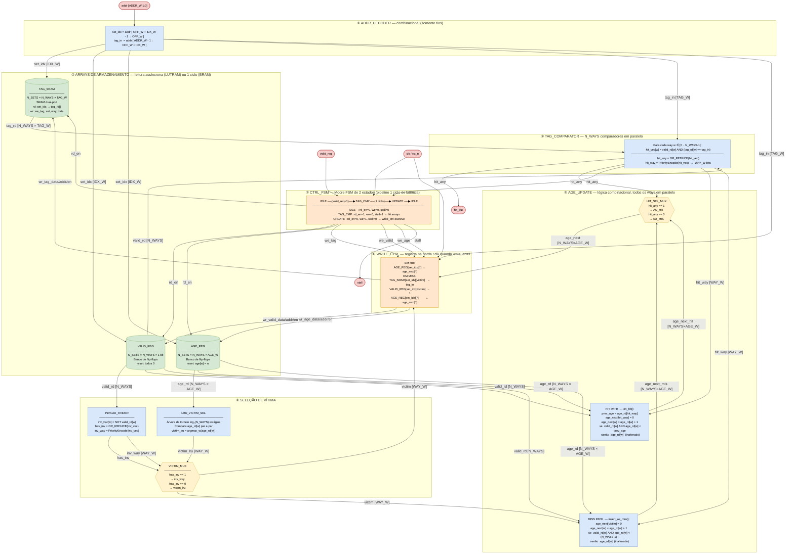
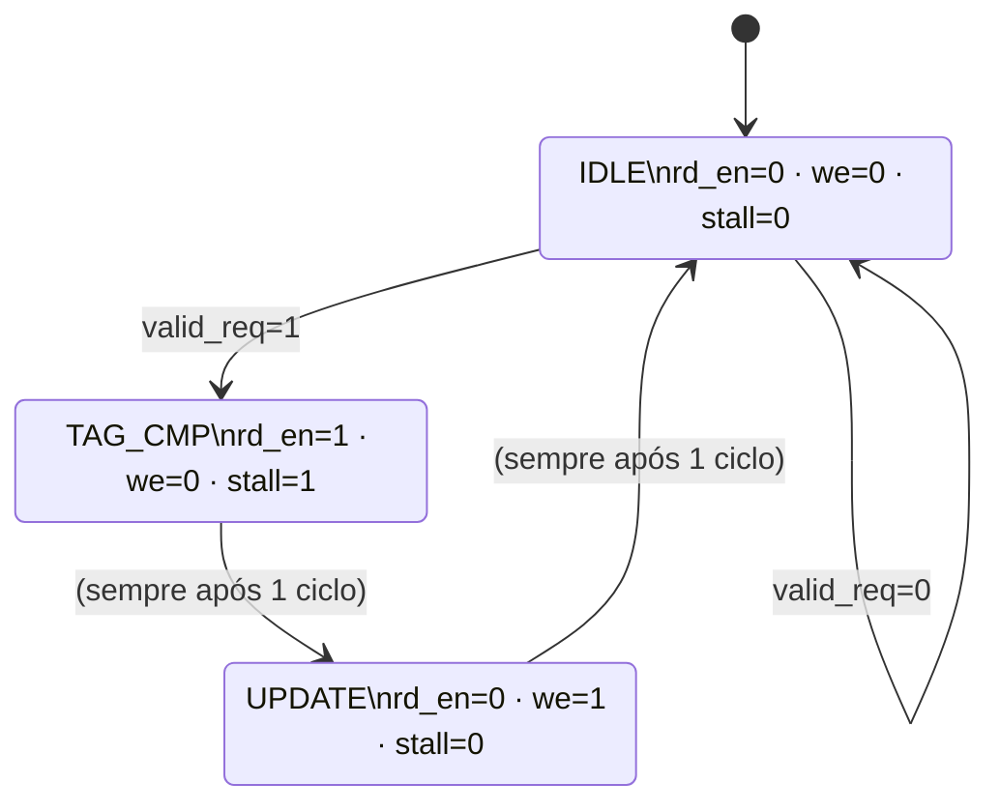

# LRU — Diagrama RTL Estrutural

Mapeamento do simulador C (`lru.c` / `cache.c`) para componentes físicos de hardware
implementáveis em Verilog / FPGA.

---

## 1. Mapeamento C → Hardware

| Elemento C | Componente RTL | Tipo de hardware |
|---|---|---|
| `cache_line_t.valid` | `valid_regfile[N_SETS][N_WAYS]` | Flip-flop (1 bit / linha) |
| `cache_line_t.tag` | `tag_sram[N_SETS][N_WAYS][TAG_W]` | SRAM dual-port (BRAM/LUTRAM) |
| `cache_line_t.lru_age` | `age_regfile[N_SETS][N_WAYS][AGE_W]` | Flip-flop (AGE_W bits / linha) |
| `cache_set_of(addr)` | Barramento `addr[OFF+IDX-1:OFF]` | Fio — sem lógica |
| `cache_tag_of(addr)` | Barramento `addr[31:OFF+IDX]` | Fio — sem lógica |
| `cache_find_way()` | `TAG_COMPARATOR` | N_WAYS comparadores em paralelo + codificador de prioridade |
| `cache_find_invalid_way()` | `INVALID_FINDER` | Codificador de prioridade em `~valid_rd` |
| `find_lru_victim()` | `LRU_VICTIM_SEL` | Árvore de torneio (max finder) |
| `on_hit()` | `AGE_UPDATE` (caminho HIT) | Lógica combinacional por way |
| `insert_as_mru()` | `AGE_UPDATE` (caminho MISS) + `WRITE_CTRL` | Lógica combinacional + FF |
| `lru_access()` | `CTRL_FSM` | Moore FSM sequencial |

---

## 2. Parâmetros e Larguras de Barramento

| Parâmetro | Fórmula | Config A (4KB/32B/2v) | Config B (4KB/32B/4v) | Config C (8KB/32B/4v) |
|---|---|---|---|---|
| `ADDR_W` | 32 | 32 | 32 | 32 |
| `OFF_W` | log₂(BLOCK_B) | 5 | 5 | 5 |
| `N_SETS` | SIZE/(BLOCK×WAYS) | 64 | 32 | 64 |
| `IDX_W` | log₂(N_SETS) | 6 | 5 | 6 |
| `TAG_W` | ADDR_W−OFF_W−IDX_W | 21 | 22 | 21 |
| `N_WAYS` | associatividade | 2 | 4 | 4 |
| `WAY_W` | log₂(N_WAYS) | 1 | 2 | 2 |
| `AGE_W` | log₂(N_WAYS) | 1 | 2 | 2 |
| SRAM total | N_SETS×N_WAYS×TAG_W | 2 688 b | 2 816 b | 5 376 b |
| Age total | N_SETS×N_WAYS×AGE_W | 128 b | 256 b | 512 b |

---

## 3. Diagrama RTL Completo

**Legenda de cores:**
- 🔵 Azul claro — lógica combinacional pura
- 🟢 Verde — SRAM / banco de registradores (armazenamento)
- 🟡 Amarelo — multiplexador / seletor
- 🟠 Laranja — lógica sequencial / registrador de saída
- 🔴 Rosa — portas de I/O do módulo top



---

## 4. FSM de Controle



---

## 5. Descrição dos Blocos

### ① ADDR_DECODER
Apenas fios. Extrai `set_idx` e `tag_in` de `addr` via seleção de bits — zero LUTs.

```
set_idx = addr[OFF_W + IDX_W - 1 : OFF_W]
tag_in  = addr[ADDR_W - 1 : OFF_W + IDX_W]
```

### ② ARRAYS DE ARMAZENAMENTO
Três estruturas independentes acessadas pelo mesmo `set_idx`:
- **TAG_SRAM**: leitura de `N_WAYS` tags completos na borda de clock (BRAM) ou assíncrona (LUTRAM).
- **VALID_REG**: flip-flops, reset assíncrono para 0.
- **AGE_REG**: flip-flops, reset inicializa `age[w] = w` para idades distintas (invariante do LRU).

### ③ TAG_COMPARATOR
`N_WAYS` comparadores de `TAG_W` bits em paralelo. Cada comparador gera `hit_vec[w]`. A saída `hit_way` é um codificador de prioridade — qualquer way pode ser hit, mas ao mais uma por conjunto por invariante do LRU.

### ④ SELEÇÃO DE VÍTIMA
- **INVALID_FINDER**: codificador de prioridade em `~valid`. Se existe linha inválida, ela é a vítima direta (capacidade livre, sem desalojo).
- **LRU_VICTIM_SEL**: árvore de torneio de profundidade `log₂(N_WAYS)`. Cada nó compara dois `age` values e passa o maior. Raiz retorna `victim_lru`.
- **VICTIM_MUX**: seleciona `inv_way` se `has_inv=1`, senão `victim_lru`.

### ⑤ AGE_UPDATE
Lógica paralela em todos os `N_WAYS` ways. Implementa as duas funções C:
- **HIT (`on_hit`)**: `age[hit_way]←0`; ways com `age < prev_age` são incrementados em 1.
- **MISS (`insert_as_mru`)**: `age[victim]←0`; ways válidos com `age < N_WAYS-1` são incrementados em 1.

Em hardware, cada way tem um multiplexador de 2 bits de seleção:
```
age_next[w] = (w == anchor) ? AGE_W'(0)
            : (cond[w])     ? age_rd[w] + 1
            :                 age_rd[w];
```

### ⑥ WRITE_CTRL
Registra os resultados computados por `AGE_UPDATE` (e `tag_in`/`victim` no caso de miss) nos arrays de armazenamento na borda ↑clk, controlado pelos sinais `we_*` da FSM.

### ⑦ CTRL_FSM
Moore FSM de 2 estados operacionais. Em implementação pipelinada, pode aceitar nova requisição a cada ciclo depois do estado de leitura (throughput = 1 acesso/ciclo, latência = 2 ciclos).
